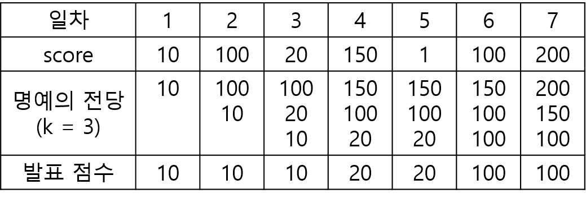
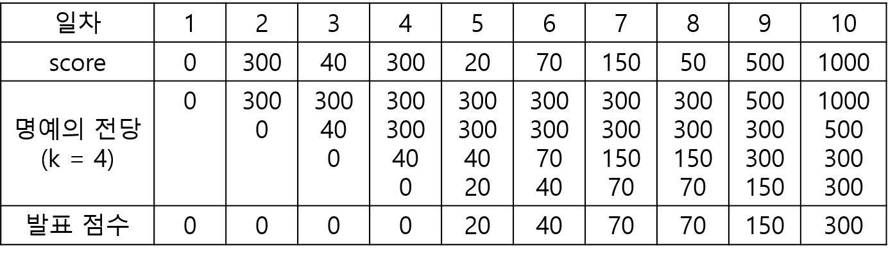

# 명예의 전당 (1)

### 문제 설명

"명예의 전당"이라는 TV 프로그램에서는 매일 1명의 가수가 노래를 부르고, 시청자들의 문자 투표수로 가수에게 점수를 부여합니다. 매일 출연한 가수의 점수가 지금까지 출연 가수들의 점수 중 상위 k번째 이내이면 해당 가수의 점수를 명예의 전당이라는 목록에 올려 기념합니다. 즉 프로그램 시작 이후 초기에 k일까지는 모든 출연 가수의 점수가 명예의 전당에 오르게 됩니다. k일 다음부터는 출연 가수의 점수가 기존의 명예의 전당 목록의 k번째 순위의 가수 점수보다 더 높으면, 출연 가수의 점수가 명예의 전당에 오르게 되고 기존의 k번째 순위의 점수는 명예의 전당에서 내려오게 됩니다.

이 프로그램에서는 매일 "명예의 전당"의 최하위 점수를 발표합니다. 예를 들어, k = 3이고, 7일 동안 진행된 가수의 점수가 [10, 100, 20, 150, 1, 100, 200]이라면, 명예의 전당에서 발표된 점수는 아래의 그림과 같이 [10, 10, 10, 20, 20, 100, 100]입니다.



명예의 전당 목록의 점수의 개수 k, 1일부터 마지막 날까지 출연한 가수들의 점수인 score가 주어졌을 때, 매일 발표된 명예의 전당의 최하위 점수를 return하는 solution 함수를 완성해주세요.

### 제한사항

- 3 ≤ k ≤ 100
- 7 ≤ score의 길이 ≤ 1,000
- 0 ≤ score[i] ≤ 2,000

### 입출력 예

| k   | score                                         | result                                 |
| --- | --------------------------------------------- | -------------------------------------- |
| 3   | [10, 100, 20, 150, 1, 100, 200]               | [10, 10, 10, 20, 20, 100, 100]         |
| 4   | [0, 300, 40, 300, 20, 70, 150, 50, 500, 1000] | [0, 0, 0, 0, 20, 40, 70, 70, 150, 300] |

### 입출력 예 설명

입출력 예 #1
문제의 예시와 같습니다.

입출력 예 #2
아래와 같이, [0, 0, 0, 0, 20, 40, 70, 70, 150, 300]을 return합니다.


### 출처

---

### 1. 의사코드

1. "명예의 전당"과 "최하위 점수"를 담을 빈 배열을 하나씩 만들어준다.
2. score의 길이가 k보다 긴 경우와 짧거나 같은 경우를 나눈다.
3. 긴 경우 score의 k길이 전까지 요소에 접근하여 차례차례 하나씩 점수를 넣어 "명예의 전당"을 만들고 "명예의 전당"에서 가장 작은 수를 "최악의 점수" 배열에 넣는다.
4. score의 길이가 k를 넘을 때는 하나씩 명예의 전당에 넣어 가장 작은 수를 밀어내고난 후 명예의 전당에서 가장 작은 수를 "최악의 점수" 배열에 넣는다.
   4-1. 1개를 추가하면 명예의 전당 길이가 k+1이 된다.
   4-2. 명예의 전당을 오름차순으로 정렬한다.
   4-3. 가장 첫번째가 가장 낮은 수일테니 가장 첫번째 요소를 제거한다.
5. 짧은 경우 score 배열의 길이만큼 요소에 접근하고 하나씩 "명예의 전당"에 넣은 후 가장 작은 수를 "최악의 점수" 배열에 넣어준다.
6. "최악의 점수"를 출력한다.

### 2. 코드 연결

1. "명예의 전당"과 "최하위 점수"를 담을 빈 배열을 하나씩 만들어준다.

```javascript
let theHallOfFame = [];
let worst = [];
```

2. score의 길이가 k보다 긴 경우와 짧거나 같은 경우를 나눈다.

```javascript
if (k < score.length) {
} else {
}
```

3. 긴 경우 score의 k길이 전까지 요소에 접근하여 차례차례 하나씩 점수를 넣어 "명예의 전당"을 만들고 "명예의 전당"에서 가장 작은 수를 "최악의 점수" 배열에 넣는다.

```javascript
for (let i = 0; i < k; i++) {
  theHallOfFame.push(score[i]);
  worst.push(Math.min(...theHallOfFame));
}
```

4. score의 길이가 k를 넘을 때는 하나씩 명예의 전당에 넣어 가장 작은 수를 밀어내고난 후 명예의 전당에서 가장 작은 수를 "최악의 점수" 배열에 넣는다.

```javascript
for (let i = k; i < score.length; i++) {
  theHallOfFame.push(score[i]);
  theHallOfFame.sort((a, b) => a - b).shift();
  worst.push(Math.min(...theHallOfFame));
}
```

4-1. 1개를 추가하면 명예의 전당 길이가 k+1이 된다.

```javascript
theHallOfFame.push(score[i]);
```

4-2. 명예의 전당을 오름차순으로 정렬한다.

```javascript
theHallOfFame.sort((a, b) => a - b);
```

4-3. 가장 첫번째가 가장 낮은 수일테니 가장 첫번째 요소를 제거한다.

```javascript
.shift()
```

5. 짧은 경우 score 배열의 길이만큼 요소에 접근하고 하나씩 "명예의 전당"에 넣은 후 가장 작은 수를 "최악의 점수" 배열에 넣어준다.

```javascript
for (let i = 0; i < score.length; i++) {
  theHallOfFame.push(score[i]);
  worst.push(Math.min(...theHallOfFame));
}
```

6. "최악의 점수"를 출력한다.

```javascript
return worst;
```

### 3. 완성 코드

```javascript
function solution(k, score) {
  let theHallOfFame = [];
  let worst = [];

  if (k < score.length) {
    for (let i = 0; i < k; i++) {
      theHallOfFame.push(score[i]);
      worst.push(Math.min(...theHallOfFame));
    }

    for (let i = k; i < score.length; i++) {
      theHallOfFame.push(score[i]);
      theHallOfFame.sort((a, b) => a - b).shift();
      worst.push(Math.min(...theHallOfFame));
    }
  } else {
    for (let i = 0; i < score.length; i++) {
      theHallOfFame.push(score[i]);
      worst.push(Math.min(...theHallOfFame));
    }
  }

  return worst;
}
```
