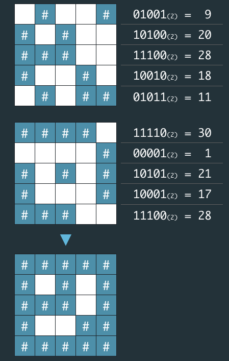

# [1차] 비밀지도

### 문제설명

비밀지도
네오는 평소 프로도가 비상금을 숨겨놓는 장소를 알려줄 비밀지도를 손에 넣었다. 그런데 이 비밀지도는 숫자로 암호화되어 있어 위치를 확인하기 위해서는 암호를 해독해야 한다. 다행히 지도 암호를 해독할 방법을 적어놓은 메모도 함께 발견했다.

1. 지도는 한 변의 길이가 `n`인 정사각형 배열 형태로, 각 칸은 "공백"(" ") 또는 "벽"("#") 두 종류로 이루어져 있다.
2. 전체 지도는 두 장의 지도를 겹쳐서 얻을 수 있다. 각각 "지도 1"과 "지도 2"라고 하자. 지도 1 또는 지도 2 중 어느 하나라도 벽인 부분은 전체 지도에서도 벽이다. 지도 1과 지도 2에서 모두 공백인 부분은 전체 지도에서도 공백이다.
3. "지도 1"과 "지도 2"는 각각 정수 배열로 암호화되어 있다.
4. 암호화된 배열은 지도의 각 가로줄에서 벽 부분을 1, 공백 부분을 0으로 부호화했을 때 얻어지는 이진수에 해당하는 값의 배열이다.



네오가 프로도의 비상금을 손에 넣을 수 있도록, 비밀지도의 암호를 해독하는 작업을 도와줄 프로그램을 작성하라.

### 입력 형식

입력으로 지도의 한 변 크기 `n` 과 2개의 정수 배열 `arr1`, `arr2`가 들어온다.

- 1 ≦ `n` ≦ 16
- `arr1`, `arr2`는 길이 `n`인 정수 배열로 주어진다.
- 정수 배열의 각 원소 `x`를 이진수로 변환했을 때의 길이는 `n` 이하이다. 즉, 0 ≦ `x` ≦ 2n - 1을 만족한다.

### 출력 형식

원래의 비밀지도를 해독하여 `'#'`, `공백`으로 구성된 문자열 배열로 출력하라.

### 입출력 예제

| 매개변수 | 값                                          |
| -------- | ------------------------------------------- |
| n        | 5                                           |
| arr1     | [9, 20, 28, 18, 11]                         |
| arr2     | [30, 1, 21, 17, 28]                         |
| 출력     | ["#####","# # #", "### #", "# ##", "#####"] |

| 매개변수 | 값                                                         |
| -------- | ---------------------------------------------------------- |
| n        | 6                                                          |
| arr1     | [46, 33, 33 ,22, 31, 50]                                   |
| arr2     | [27 ,56, 19, 14, 14, 10]                                   |
| 출력     | ["######", "### #", "## ##", " #### ", " #####", "### # "] |

### 출처

https://school.programmers.co.kr/learn/courses/30/lessons/17681

---

### 1. 의사코드

1. 정답을 담을 빈배열을 만든다.
2. arr1과 arr2를 2진법으로 만든다.
3. n자리수만큼 0을 채워준다.
4. 배열안에 정답을 담을 빈 문자열을 만든다.
5. 변경된 arr1 과 arr2가 모두 "0"인 경우 빈 문자열을 추가해준다.
6. 그렇지 않으면 "#"을 추가한다.

### 2. 코드연결

1. 정답을 담을 빈배열을 만든다.

```javascript
let secretMap = [];
```

2. arr1과 arr2를 2진법으로 만든다.

```javascript
const binaryArr1 = arr1.map((element) => element.toString(2));
const binaryArr2 = arr2.map((element) => element.toString(2));
```

3. n자리수만큼 0을 채워준다.

```javascript
const plus0 = (n, string) => {
  let str = [];
  for (let i = 0; i < n; i++) {
    if (!string[i]) {
      str.unshift("0");
    } else {
      str.push(string[i]);
    }
  }
  return str;
};

const binaryArr1 = arr1.map((element) => plus0(n, element.toString(2)));
const binaryArr2 = arr2.map((element) => plus0(n, element.toString(2)));
```

4. 배열안에 정답을 담을 빈 문자열을 만든다.

```javascript
for (let i = 0; i < n; i++) {
  secretMap[i] = "";
}
```

5. 변경된 arr1 과 arr2가 모두 "0"인 경우 빈 문자열을 추가해준다.

```javascript
if (binaryArr1[i][j] === "0" && binaryArr2[i][j] === "0") {
  secretMap[i] += " ";
}
```

6. 그렇지 않으면 "#"을 추가한다.

```javascript
else {
    secretMap[i] += "#";
}
```

### 3. 완성 코드

```javascript
function solution(n, arr1, arr2) {
  let secretMap = [];

  const plus0 = (n, string) => {
    let str = [];
    for (let i = 0; i < n; i++) {
      if (!string[i]) {
        str.unshift("0");
      } else {
        str.push(string[i]);
      }
    }
    return str;
  };

  const binaryArr1 = arr1.map((element) => plus0(n, element.toString(2)));
  const binaryArr2 = arr2.map((element) => plus0(n, element.toString(2)));

  for (let i = 0; i < n; i++) {
    secretMap[i] = "";
    for (let j = 0; j < n; j++) {
      if (binaryArr1[i][j] === "0" && binaryArr2[i][j] === "0") {
        secretMap[i] += " ";
      } else {
        secretMap[i] += "#";
      }
    }
  }

  return secretMap;
}
```

💡 처음 빈배열을 초기화 해주는 것 처럼 문자열도 초기화 해줘야한다.(할당먼저)
