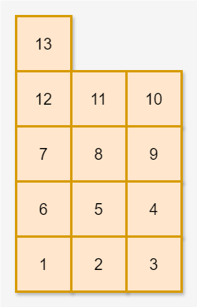

# 택배 상자 꺼내기

### 문제 설명

1 ~ `n`의 번호가 있는 택배 상자가 창고에 있습니다. 당신은 택배 상자들을 다음과 같이 정리했습니다.

왼쪽에서 오른쪽으로 가면서 1번 상자부터 번호 순서대로 택배 상자를 한 개씩 놓습니다. 가로로 택배 상자를 `w`개 놓았다면 이번에는 오른쪽에서 왼쪽으로 가면서 그 위층에 택배 상자를 한 개씩 놓습니다. 그 층에 상자를 `w`개 놓아 가장 왼쪽으로 돌아왔다면 또다시 왼쪽에서 오른쪽으로 가면서 그 위층에 상자를 놓습니다. 이러한 방식으로 `n`개의 택배 상자를 모두 놓을 때까지 한 층에 `w`개씩 상자를 쌓습니다.


- 위 그림은 w = 6일 때 택배 상자 22개를 쌓은 예시입니다.

다음 날 손님은 자신의 택배를 찾으러 창고에 왔습니다. 당신은 손님이 자신의 택배 상자 번호를 말하면 해당 택배 상자를 꺼내줍니다. 택배 상자 A를 꺼내려면 먼저 A 위에 있는 다른 모든 상자를 꺼내야 A를 꺼낼 수 있습니다. 예를 들어, 위 그림에서 8번 상자를 꺼내려면 먼저 20번, 17번 상자를 꺼내야 합니다.

당신은 꺼내려는 상자 번호가 주어졌을 때, 꺼내려는 상자를 포함해 총 몇 개의 택배 상자를 꺼내야 하는지 알고 싶습니다.

창고에 있는 택배 상자의 개수를 나타내는 정수 `n`, 가로로 놓는 상자의 개수를 나타내는 정수 `w`와 꺼내려는 택배 상자의 번호를 나타내는 정수 `num`이 매개변수로 주어집니다. 이때, 꺼내야 하는 상자의 총개수를 return 하도록 solution 함수를 완성해 주세요.

### 제한사항

- 2 ≤ `n` ≤ 100
- 1 ≤ `w` ≤ 10
- 1 ≤ `num` ≤ `n`

### 테스트 케이스 구성 안내

아래는 테스트 케이스 구성을 나타냅니다. 각 그룹 내의 테스트 케이스를 모두 통과하면 해당 그룹에 할당된 점수를 획득할 수 있습니다.

| 그룹 총점 | 추가 | 제한 사항           |
| --------- | ---- | ------------------- |
| #1        | 10%  | w = 1               |
| #2        | 20%  | n은 w의 배수입니다. |
| #3        | 70%  | 추가 제한 사항 없음 |

### 입출력 예

| n   | w   | num | result |
| --- | --- | --- | ------ |
| 22  | 6   | 8   | 3      |
| 13  | 3   | 6   | 4      |

### 입출력 예 설명

입출력 예 #1
문제 예시와 같습니다. 꺼내야 하는 상자의 총개수는 8번 상자를 포함해 3개입니다.

입출력 예 #2

6번 상자를 꺼내려면 먼저 13, 12, 7번 상자를 꺼내야 합니다.
따라서 4를 return 합니다.

### 출처

https://school.programmers.co.kr/learn/courses/30/lessons/389478

---

### 1. 의사코드

1. 택배상자를 2차원 배열의 형태로 만든다.
2. 없는 부분도 공간을 차지해야하므로 0을 넣어준다.
3. 짝수 줄은 반대로 물건을 쌓는것처럼 순서를 변경해준다.
4. 속 배열에서 `num`을 찾아 index를 알아낸다.
5. 속 배열을 동일한 index를 가지고있는 값으로 변경한다.
6. 만약 0이라면 제거한다.
7. `num`의 index+1을 뽑아낸다.

### 2. 코드 연결

1. 택배상자를 2차원 배열의 형태로 만든다.

```javascript
let array = [];
let temp = [];

for (let i = 1; i <= n; i++) {
  temp.push(i);

  if (temp.length === w) {
    array.push(temp);
    temp = [];
  }
}
```

2. 없는 부분도 공간을 차지해야하므로 0을 넣어준다.

```javascript
if (temp.length > 0) {
  while (temp.length < w) {
    temp.push(0);
  }
  array.push(temp);
}
```

3. 짝수 줄은 반대로 물건을 쌓는것처럼 순서를 변경해준다.

```javascript
const box = array
  .map((arr, idx) => (idx % 2 === 0 ? arr : arr.reverse()))
  .reverse();
```

4. 속 배열에서 `num`을 찾아 index를 알아낸다.

```javascript
const index = box.find((arr) => arr.includes(num)).indexOf(num);
```

5. 속 배열을 동일한 index를 가지고있는 값으로 변경한다.

```javascript
const answer = box.map((arr) => arr[index]);
```

6. 만약 0이라면 제거한다.

```javascript
.filter((v) => v)
```

7. `num`의 index+1을 뽑아낸다.

```javascript
return answer.indexOf(num) + 1;
```

### 3. 완성 코드

```javascript
function solution(n, w, num) {
  let array = [];
  let temp = [];

  for (let i = 1; i <= n; i++) {
    temp.push(i);

    if (temp.length === w) {
      array.push(temp);
      temp = [];
    }
  }

  if (temp.length > 0) {
    while (temp.length < w) {
      temp.push(0);
    }
    array.push(temp);
  }
  const box = array
    .map((arr, idx) => (idx % 2 === 0 ? arr : arr.reverse()))
    .reverse();

  const index = box.find((arr) => arr.includes(num)).indexOf(num);

  const answer = box.map((arr) => arr[index]).filter((v) => v);
  return answer.indexOf(num) + 1;
}
```

💡 ai가 알려준 간결한 버전

```javascript
function solution(n, w, num) {
  // 1. 배열 생성 및 0 패딩
  const chunks = Array.from({ length: Math.ceil(n / w) }, (_, i) => {
    const start = i * w + 1;
    const row = Array.from({ length: w }, (_, j) => start + j).map((v) =>
      v > n ? 0 : v
    );
    return i % 2 === 0 ? row : row.reverse();
  }).reverse();

  // 2. num이 위치한 열(column index) 찾기
  const colIndex = chunks.find((row) => row.includes(num))?.indexOf(num);
  if (colIndex === undefined) return -1; // num이 없을 경우

  // 3. 해당 열의 값들만 모으기
  const columnValues = chunks.map((row) => row[colIndex]);

  // 4. 열 내에서 몇 번째에 위치하는지 반환
  return columnValues.indexOf(num) + 1;
}
```

✅ 개선 내용 요약
|항목 |변경 전| 변경 후|
|--|--|--|
|배열 분할| 수동 for + push 반복 |Array.from + map|
|0 채우기 |while로 수동 채움| map에서 조건 체크로 간결화|
|짝수/홀수 처리| map으로 조건 분기| i % 2 === 0 ? row : row.reverse()|
|num 위치 찾기| find().indexOf() 사용 |동일하지만 optional chaining 사용|
|예외 처리 |없음 |colIndex === undefined 체크 추가|
