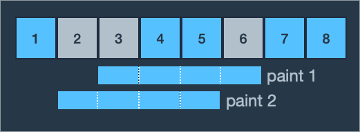
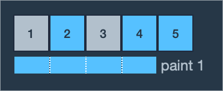
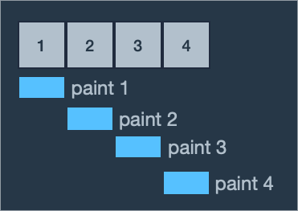

# 덧칠하기

### 문제 설명

어느 학교에 페인트가 칠해진 길이가 `n`미터인 벽이 있습니다. 벽에 동아리 · 학회 홍보나 회사 채용 공고 포스터 등을 게시하기 위해 테이프로 붙였다가 철거할 때 떼는 일이 많고 그 과정에서 페인트가 벗겨지곤 합니다. 페인트가 벗겨진 벽이 보기 흉해져 학교는 벽에 페인트를 덧칠하기로 했습니다.

넓은 벽 전체에 페인트를 새로 칠하는 대신, 구역을 나누어 일부만 페인트를 새로 칠 함으로써 예산을 아끼려 합니다. 이를 위해 벽을 1미터 길이의 구역 `n`개로 나누고, 각 구역에 왼쪽부터 순서대로 1번부터 `n`번까지 번호를 붙였습니다. 그리고 페인트를 다시 칠해야 할 구역들을 정했습니다.

벽에 페인트를 칠하는 롤러의 길이는 `m`미터이고, 롤러로 벽에 페인트를 한 번 칠하는 규칙은 다음과 같습니다.

- 롤러가 벽에서 벗어나면 안 됩니다.
- 구역의 일부분만 포함되도록 칠하면 안 됩니다.

즉, 롤러의 좌우측 끝을 구역의 경계선 혹은 벽의 좌우측 끝부분에 맞춘 후 롤러를 위아래로 움직이면서 벽을 칠합니다. 현재 페인트를 칠하는 구역들을 완전히 칠한 후 벽에서 롤러를 떼며, 이를 벽을 한 번 칠했다고 정의합니다.

한 구역에 페인트를 여러 번 칠해도 되고 다시 칠해야 할 구역이 아닌 곳에 페인트를 칠해도 되지만 다시 칠하기로 정한 구역은 적어도 한 번 페인트칠을 해야 합니다. 예산을 아끼기 위해 다시 칠할 구역을 정했듯 마찬가지로 롤러로 페인트칠을 하는 횟수를 최소화하려고 합니다.

정수 `n`, `m`과 다시 페인트를 칠하기로 정한 구역들의 번호가 담긴 정수 배열 `section`이 매개변수로 주어질 때 롤러로 페인트칠해야 하는 최소 횟수를 return 하는 solution 함수를 작성해 주세요.

### 제한사항

- 1 ≤ m ≤ n ≤ 100,000
- 1 ≤ section의 길이 ≤ n
- 1 ≤ section의 원소 ≤ n
  - section의 원소는 페인트를 다시 칠해야 하는 구역의 번호입니다.
  - section에서 같은 원소가 두 번 이상 나타나지 않습니다.
  - section의 원소는 오름차순으로 정렬되어 있습니다.

### 입출력 예

| n   | m   | section      | result |
| --- | --- | ------------ | ------ |
| 8   | 4   | [2, 3, 6]    | 2      |
| 5   | 4   | [1, 3]       | 1      |
| 4   | 1   | [1, 2, 3, 4] | 4      |

### 입출력 예 설명

**입출력 예 #1**

예제 1번은 2, 3, 6번 영역에 페인트를 다시 칠해야 합니다. 롤러의 길이가 4미터이므로 한 번의 페인트칠에 연속된 4개의 구역을 칠할 수 있습니다. 처음에 3, 4, 5, 6번 영역에 페인트칠을 하면 칠해야 할 곳으로 2번 구역만 남고 1, 2, 3, 4번 구역에 페인트칠을 하면 2번 만에 다시 칠해야 할 곳에 모두 페인트칠을 할 수 있습니다.



2번보다 적은 횟수로 2, 3, 6번 영역에 페인트를 덧칠하는 방법은 없습니다. 따라서 최소 횟수인 2를 return 합니다.

**입출력 예 #2**

예제 2번은 1, 3번 영역에 페인트를 다시 칠해야 합니다. 롤러의 길이가 4미터이므로 한 번의 페인트칠에 연속된 4개의 구역을 칠할 수 있고 1, 2, 3, 4번 영역에 페인트칠을 하면 한 번에 1, 3번 영역을 모두 칠할 수 있습니다.



따라서 최소 횟수인 1을 return 합니다.

**입출력 예 #3**

예제 3번은 모든 구역에 페인트칠을 해야 합니다. 롤러의 길이가 1미터이므로 한 번에 한 구역밖에 칠할 수 없습니다. 구역이 4개이므로 각 구역을 한 번씩만 칠하는 4번이 최소 횟수가 됩니다.



따라서 4를 return 합니다.

### 출처

https://school.programmers.co.kr/learn/courses/30/lessons/161989

---

### 1. 의사코드

1. 정답을 담을 answer와 기준이 들어갈 end 변수를 만들어준다.
2. 0부터 section의 길이까지 하나씩 돌아준다.
3. 만약 section의 i번째가 기준(end)보다 크다면 answer에 1을 더한다.
4. 또한 end의 기준을 section의 i번째 요소에 m을 더한 수에 한칸을 뺀 수로 재할당 한다.

### 2. 코드 연결

1. 정답을 담을 answer와 기준이 들어갈 end 변수를 만들어준다.

```javascript
let answer = 0;
let end = 0;
```

2. 0부터 section의 길이까지 하나씩 돌아준다.

```javascript
or (let i = 0; i < section.length; i++) {}
```

3. 만약 section의 i번째가 기준(end)보다 크다면 answer에 1을 더한다.

```javascript
if (section[i] > end) {
  answer++;
}
```

4. 또한 end의 기준을 section의 i번째 요소에 m을 더한 수에 한칸을 뺀 수로 재할당 한다.

```javascript
end = section[i] + m - 1;
```

### 3. 완성 코드

```javascript
function solution(n, m, section) {
  let answer = 0;
  let end = 0;

  for (let i = 0; i < section.length; i++) {
    if (section[i] > end) {
      answer++;
      end = section[i] + m - 1;
    }
  }
  return answer;
}
```

💡 의외로 헤맨 문제
💡 기준점을 잡아주는게 중요한 포인트
💡 for문의 i를 잘 사용하는것도 포인트
